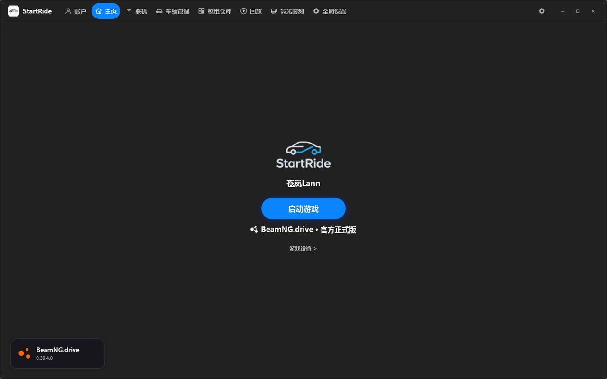
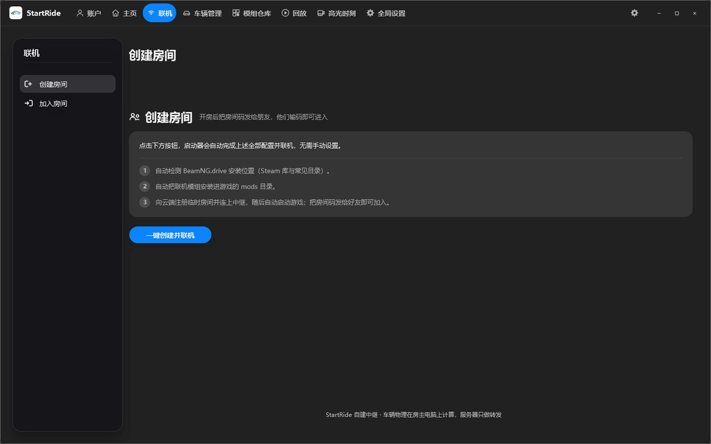
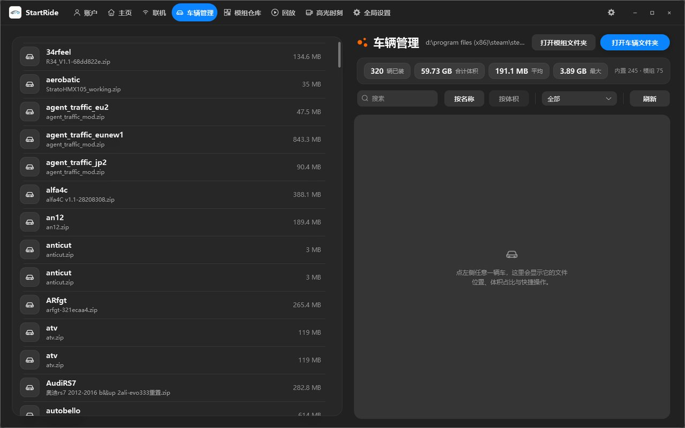
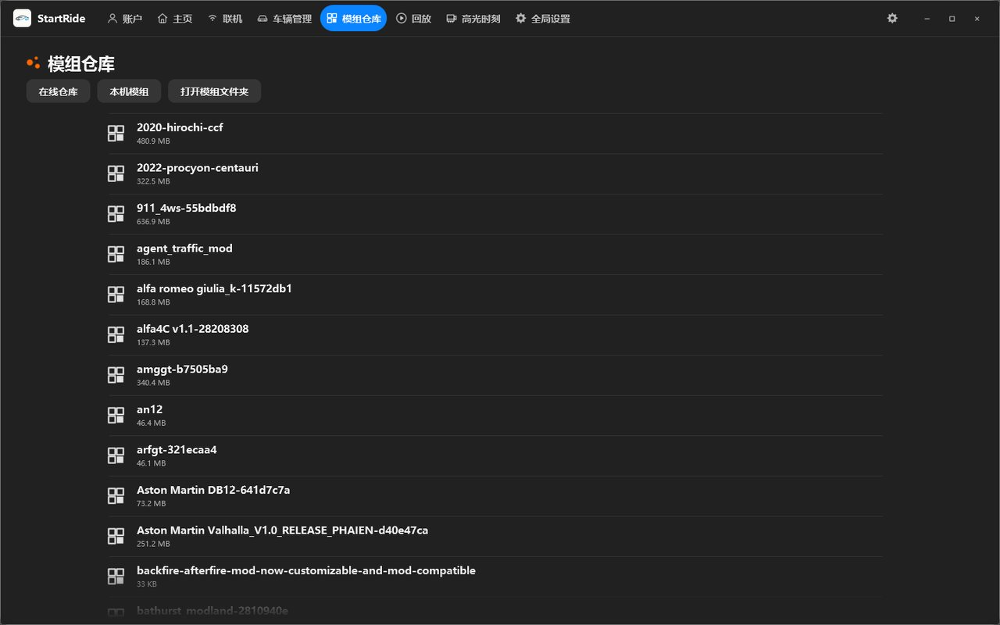
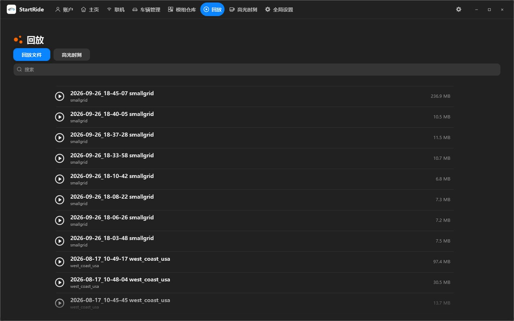
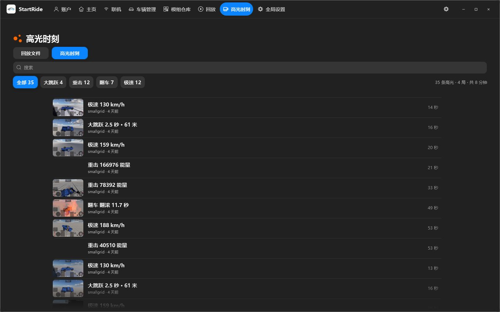
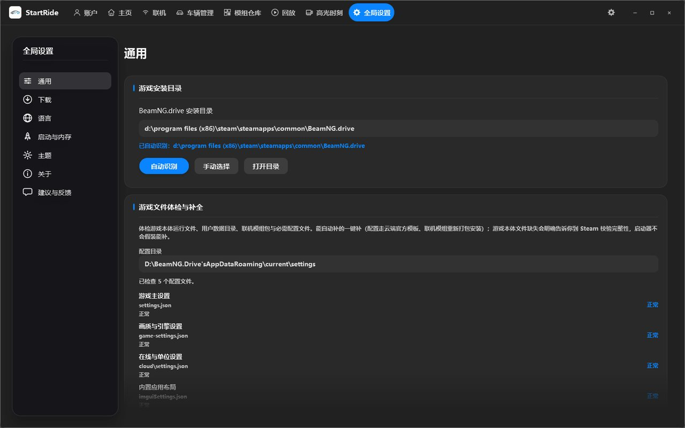

# StartRide

[](LICENSE)
[](https://github.com/CangLann-xyq/StartRide/releases)
[](#)
[](#)

**BeamNG.drive 多人联机启动器** · Windows · C# / WPF (.NET 8) · [English overview](#english-overview)

StartRide 把「装模组 → 找房间 → 进游戏」这几件事收进一个窗口里。它自建了一套中继
服务，用房间码组队，不依赖任何第三方穿透工具，也不需要你在路由器上开端口。

---

## English overview

**StartRide** is an open-source multiplayer launcher for **BeamNG.drive**, written in
C# / WPF (.NET 8) for Windows x64.

It replaces the manual, error-prone setup — installing in-game mods, hunting down server
addresses, configuring the game, launching it with the right arguments — with a single
window. Players create or join a room with a four-digit room code; the launcher then
installs the required in-game Lua mods, configures the game and starts it. It ships with
its own self-hosted relay service, so no third-party tunneling tool and no router port
forwarding is required on the player's side.

| | |
| --- | --- |
| Build | `dotnet publish .\StartRide.csproj -c Release -o out` — needs .NET 8 SDK; **all third-party binaries are vendored in [`third_party/launcher-libs/`](third_party/launcher-libs/)**, so a clone builds as-is |
| License | [GPL-3.0-or-later](LICENSE) — the UI layer is derived from a GPL-3.0 open-source Minecraft launcher skeleton; some inherited identifiers and third-party dependencies remain bundled but unused. See [NOTICE](NOTICE) |
| Download | [startride.top](https://startride.top) · [Releases](https://github.com/CangLann-xyq/StartRide/releases) |
| Code signing policy | [docs/code-signing.md](docs/code-signing.md) |
| Maintainer | [CangLann-xyq](https://github.com/CangLann-xyq) · cloudfur2026@qq.com |

The launcher also provides vehicle/mod/replay management, Steam account detection,
playtime statistics, cloud sync of settings and a diagnostic bundle export. The interface
is localised in Simplified Chinese, Traditional Chinese, English and Japanese.

> StartRide is an unofficial tool and is not affiliated with or endorsed by BeamNG GmbH.

---

## 界面

主页是全部功能的入口：一个按钮启动游戏，顶栏切换各功能页。



| 联机 | 车辆管理 |
| --- | --- |
|  |  |
| **模组仓库** | **回放** |
|  |  |
| **高光时刻** | **全局设置** |
|  |  |

> 截图取自 v0.1.8，未做后期处理。

---

## 功能

**联机**

- 自建中继：房主开房拿到一个四位房间码，其他人输码即进，无需端口映射
- 车辆物理在房主电脑上计算，中继只做转发，因此联机手感取决于房主机器
- 大厅实时显示成员与车辆数，房主可解散房间

**启动与实例**

- 自动探测 BeamNG.drive 安装位置（进程 → Steam 注册表与 libraryfolders.vdf → 卸载表 → 常见路径）
- 启动前自动安装/更新联机模组，退出后回收
- 游戏内存上限调节、配置文件完整性检查与一键修复

**资源管理**

- 车辆、模组（Mods）、回放三个管理器：列表 + 详情面板，可直接定位文件、复制路径
- 附件包体积统计与占用排序

**账户**

- Steam 账户登录（读取本机 Steam 登录态，可选联网校验游戏持有情况）
- 头像、联机 ID 与本机昵称

**其它**

- 云端同步：账户顺序、启动参数、设置项随账号漫游
- 游玩时长统计（含异常退出后的会话恢复）
- 诊断包导出：一键打包日志与配置，便于反馈问题（**不含任何账号凭据**）

---

## 构建

需要 **.NET 8 SDK** 或更高版本，Windows 10 1809+。

```powershell
git clone https://github.com/CangLann-xyq/StartRide.git
cd StartRide
dotnet publish .\StartRide.csproj -c Release -o out
```

产物位于 `out\`。**仓库自带全部第三方依赖**（`third_party\launcher-libs\`，共 29 个 DLL，
已随源码一并分发），因此克隆下来即可直接构建，不需要额外下载任何二进制文件；
NuGet 只需要还原 `System.Management` 一个包。

> 发行版**只由本仓库源码构建**：维护者用上面完全相同的命令在本机构建、打包，
> 产物不经任何手工修改。用于签名发版的流水线
> [`.github/workflows/release-sign.yml`](.github/workflows/release-sign.yml)
> 会从同一个 tag、用同一份源码与依赖在 GitHub 托管的运行器上复现这次构建，
> 并把产物提交给签名服务 —— 这也是本项目在 SignPath 申请中承诺的构建方式。

### 改完样式后请跑一次引用检查

WPF 的 `{StaticResource}` 在**资源字典合并时**解析，因此 `styles/` 下靠后的字典里定义的样式，
不能被靠前的字典用 `BasedOn="{StaticResource ...}"` 引用——这种**跨文件前向引用**编译期不报错，
但会在 `MainWindow` 加载时抛 `XamlParseException`，表现为启动器一闪而过、退出码 `-1`。

```powershell
python .\tools\check-style-refs.py
```

它按 `styles/ControlStyles.xaml` 里的合并顺序，逐文件核对每个 `StaticResource` 引用是否可用，
有跨文件前向引用时退出码为 `1`，可直接用作 CI 门禁。

---

## 目录结构

| 路径 | 说明 |
| --- | --- |
| `StartRide/` | 自研模块：联机会话、中继客户端、模组安装、Steam 登录、云端同步、链接常量等 |
| `Mods/` | 游戏内 Lua 联机模组（打包进发行包） |
| `styles/` | 界面样式：按钮、输入、列表、导航、对话框、滚动 |
| `resources/themes/` | 主题与配色（深色 / 浅色 / 强调色） |
| `Assets/branding/` | 品牌图标与 Logo |
| `tools/` | 开发辅助脚本（样式引用检查等） |
| `StartRide.App.*` | 界面、视图模型与服务层 |

---

## 许可证与来源声明

本项目以 **GNU General Public License v3.0** 发布，详见 [LICENSE](LICENSE)。

StartRide 的界面层基于一个开源 Minecraft 启动器（GPL-3.0）的既有骨架改造而来。
依照 GPL-3.0，本项目同样以 GPL-3.0 授权，完整源代码在
[本仓库](https://github.com/CangLann-xyq/StartRide) 公开。

**属于独立实现的部分**：联机会话与中继协议、模组安装与版本校验、BeamNG 启动与运行时
管理、游玩时长统计、诊断包导出、云端同步、Steam 登录、以及全部车辆/模组/回放的管理界面。

界面层沿用上述骨架，因此仓库与发行包中仍能见到该骨架遗留的内部标识符（类型名、
资源键名）及其部分第三方依赖库（`CmlLib.Core`、`XboxAuthNet` 系列等，版权与许可见
[docs/legal/06-third-party-notices.md](docs/legal/06-third-party-notices.md)）。

那个启动器面向 Minecraft。它面向 Minecraft 的那套界面（整合包、光影、资源包、
Java/内存、世界等）**已不在 StartRide 的导航中** —— 当前一级页面只有
账户、启动、联机、下载、游戏设置、资源、设置、安装、高光时刻九个；
对应位置改由 BeamNG.drive 的实现承担（例如「皮肤」在 StartRide 中即车辆涂装）。

但请留意：**这不等同于相关代码与第三方依赖已从项目中删除**。它们仍然留在源码与
发行包内，其中少数还会被实例化（例如上游的 Modrinth 搜索视图模型仍注册在容器里），
只是没有任何界面入口。上面那句「已不在导航中」说的是界面，不是说这些代码不存在。

第三方依赖及其许可证可在启动器「设置 → 关于」中查看。

---

## 法律文件

使用本软件前请阅读下列文件。**软件内「设置 → 版权及法律声明」以及首次启动的
同意条款弹窗里都能直接点开它们** —— 正文随安装包一起分发，由启动器内置的阅读器
直接渲染，**不跳浏览器、离线也能看**。

| 文件 | 仓库源文 |
|---|---|
| 用户服务协议 | [docs/legal/01-user-agreement.md](docs/legal/01-user-agreement.md) |
| 隐私政策 | [docs/legal/02-privacy-policy.md](docs/legal/02-privacy-policy.md) |
| 未成年人个人信息保护规则 | [docs/legal/03-minor-protection.md](docs/legal/03-minor-protection.md) |
| 免责声明与风险提示 | [docs/legal/04-disclaimer.md](docs/legal/04-disclaimer.md) |
| 联机服务使用规范 | [docs/legal/05-multiplayer-conduct.md](docs/legal/05-multiplayer-conduct.md) |
| 第三方组件与开源许可声明 | [docs/legal/06-third-party-notices.md](docs/legal/06-third-party-notices.md) |
| 开源许可与版权声明（GPL-3.0 全文） | [docs/legal/07-open-source-license.md](docs/legal/07-open-source-license.md) |

`docs/legal/` 下的 Markdown 就是**唯一正文源**：`StartRide.csproj` 把它们作为嵌入资源
打进程序集，启动器运行时直接读自己程序集里的正文。所以**改完条款要重新构建发版才会生效**，
流程见 [docs/legal/README.md](docs/legal/README.md)。
（`docs/legal/README.md` 本身不进包，它是给维护者看的。）

> `07-open-source-license.md` 是脚本从根目录 `LICENSE` 生成的，不要手改。

---

## 维护者

StartRide 是**个人独立开发并维护**的开源项目，全部代码提交与版本发布均由维护者本人完成。

- 维护者：[CangLann-xyq](https://github.com/CangLann-xyq)（本仓库所有者）
- 项目主页：[startride.top](https://startride.top)
- 联系邮箱：cloudfur2026@qq.com

GitHub 账号 [CangLann-xyq](https://github.com/CangLann-xyq) 与项目站点
[startride.top](https://startride.top) 均由维护者本人运营；本仓库的全部源码与
[Releases](https://github.com/CangLann-xyq/StartRide/releases) 中的发行版出自同一人，
可用上列邮箱联系。版权归属与项目-作者关系声明见根目录 [NOTICE](NOTICE)。

---

## Code signing policy（代码签名政策）

完整政策正文见 **[docs/code-signing.md](docs/code-signing.md)**（团队角色、签名范围、
构建与发布流程、隐私与卸载说明）。

本项目**尚未取得代码签名证书**，因此 Windows 首次运行会提示「未知发布者」或
「Windows 已保护你的电脑」。这是所有未签名程序的统一待遇，不代表程序有问题 ——
点击提示里的「更多信息」→「仍要运行」即可继续。

> 维护者已按 [SignPath Foundation](https://signpath.org) 的开源项目免费签名计划提交申请
> （OSI 许可、公开仓库、自动化构建、人工批准签署等条件均已满足，签名用的 CI 流水线见
> [`.github/workflows/release-sign.yml`](.github/workflows/release-sign.yml)）。
> 在证书签发之前，上面的提示会一直存在。

每个发行包都由维护者本人从本仓库源码构建，发布在
[Releases](https://github.com/CangLann-xyq/StartRide/releases) 与官网 [startride.top](https://startride.top)，
两处的 SHA-256 一一对应，可用于校验文件完整性：

```powershell
Get-FileHash .\StartRide-Setup-<版本>-win-x64.exe -Algorithm SHA256
```

从任何第三方站点获取安装包时，请先核对 SHA-256 再运行。

---

## 相关链接

- 项目主页：[startride.top](https://startride.top)
- 问题反馈：[Issues](https://github.com/CangLann-xyq/StartRide/issues)
- 联系邮箱：cloudfur2026@qq.com

---

## 免责声明

StartRide 是非官方工具，与 BeamNG GmbH 无隶属或合作关系。BeamNG.drive 及相关商标
归其各自所有者所有。
